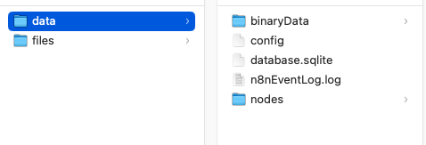

# Local n8n installation using Docker   

## What is this repo all about

The following assumes you have installed Docker on your machine.  

I started an interesting workflow automation course and this is my own setup I use to run n8n locally. Thei aim
of this repo is to have a customized installation which you can control and understand the steps rather than a magic install
which in some cases comes with much more vulnerabilities than of a base image installation.   

How I approached this build:   
1. Use a base debian bookworm image on which I downloaded the latest node LTS version.
2. Use this image to then install n8n
3. Use a runner build to start n8n and map two volumes storing the config and workflows on the host machine
  
  
This achieves the following   
* Complete control of the base linux image and the node version you want to install on in
* Complete control of which version of n8n you want to run, which can help with testing migrations to newer versions
* Complete control of mapping the folders having n8n config and workflows to the host container

## How to run it

Clone the repository and make all the .sh file executable by running:  
```shell
# chmod +x n8n-build-image.sh
# chmod +x n8n-run-image.sh
# chmod +x run.sh
```

First run the base image build:  

```shell
# ./n8n-build-image.sh
```

If you want a different node version please update the with the link to the nodejs release as well as
the references to the node release used across the file, this might be a further improvement by specifying which node
version when running the build image script as a parameter.
For this image we use the latest Node LTS version: [v22.17.0](https://nodejs.org/download/release/v22.17.0)

This will output a image named n8n-build-1752575419 where *1752575419* is the Unix epoch timestamp. You will have
a different timestamp as this is the one at the image was generated when the script is run.   

Change this base image reference in the Docker-build file on the first line in the FROM by replacing the value which
you got when you run *n8n-build-image.sh*

Run:  
```shell
# ./n8n-run-image.sh
```

This will create the n8n image ready to be run on the host machine. 

Lastly create in your home directory a folder named *n8n*  and within it the two required folders *data* and *files*. 
Data will host n8n config files and the sqllite db. Files would be the folder in which your automation scripts will be saved.
When this is complete run the start script:  
```shell
# ./run.sh
```

This will run the container. Check that the *data* folder contains the initialization of a local n8n instance as shown:  


